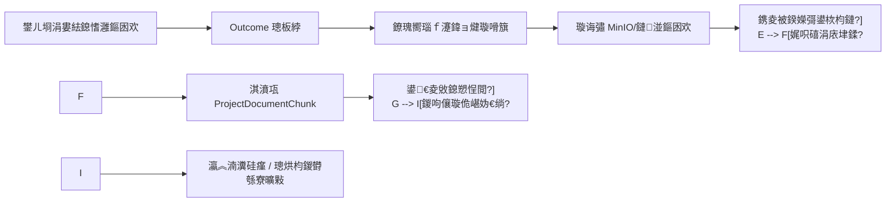

# 涓婁紶璧勬枡瑙ｆ瀽鍏ョ煡璇嗗簱鎬荤翰

## 1. 闇€姹傜悊瑙?
褰撳墠椤圭洰宸茬粡鍏峰椤圭洰鎴愭灉涓婁紶銆佷笅杞姐€佹垚鏋滄眹鎬汇€侀」鐩枃鐚簱銆侀槄璇荤瑪璁般€佽瘉鎹绱㈠拰瀛︽湳瀵硅瘽鑳藉姏锛屼絾涓婁紶璧勬枡鐩墠涓昏鍋滅暀鍦ㄢ€滄枃浠剁鐞嗏€濄€傜敤鎴蜂笂浼犵殑 PDF銆丏OCX銆乀XT銆丮D 绛夎祫鏂欐病鏈夎瑙ｆ瀽銆佸垏鍒嗐€佹矇娣€涓洪」鐩煡璇嗗簱璇佹嵁锛屽洜姝ゅ悗缁鏈璇濄€佽鏂囧啓浣滃拰鏉愭枡鐢熸垚鏃犳硶绋冲畾寮曠敤杩欎簺璧勬枡銆?
鏈柟妗堢洰鏍囨槸鎶娾€滀笂浼犺祫鏂欌€濆崌绾т负鍙绱€佸彲杩芥函銆佸彲澶嶇敤鐨勯」鐩唴閮ㄧ煡璇嗘潵婧愩€傜涓€闃舵涓嶉噸鍋氫笂浼犵郴缁燂紝涓嶅紩鍏ュ鏉傚叏鏂囨壒娉紝涓嶅仛 OCR锛屽彧琛ラ綈鏈€灏忛棴鐜細鐢ㄦ埛涓婁紶璧勬枡鍚庯紝鍙互瑙﹀彂瑙ｆ瀽鍏ュ簱锛涚郴缁熸妸鏂囦欢鍐呭鍒囧垎涓鸿瘉鎹潡锛涘鏈璇濆拰鍐欎綔妫€绱㈠彲浠ュ彫鍥炶繖浜涜瘉鎹潡锛屽苟鏄剧ず鏉ユ簮鏂囦欢銆?
## 2. 鑼冨洿纭

鏈疆鎸夌敤鎴烽€夋嫨鐨?`B` 鑼冨洿鎵ц锛?
- 鏀寔 TXT銆丮D銆丏OCX銆丳DF銆?- DOCX 浼樺厛浣跨敤鐜版湁 `python-docx`銆?- PDF 浼樺厛澶嶇敤褰撳墠鐜宸叉湁瑙ｆ瀽搴擄紱濡傛灉鎵ц鏃剁‘璁ゆ病鏈夊彲鐢ㄥ簱锛屽啀璇勪及鏂板杞婚噺渚濊禆锛屼緥濡?`pypdf` 鎴?`pdfplumber`銆?- PDF 鍙敮鎸佹枃鏈瀷 PDF锛屼笉鏀寔鎵弿浠?OCR銆?- 涓嶆柊澧炲鏉傚崗浣溿€佹壒娉ㄣ€佸叏鏂囬珮浜€丱CR 鎴栧叏鏂囨绱㈠紩鎿庛€?
## 3. 鍏抽敭鍋囪

- 缁х画浠?`Outcome` 浣滀负璧勬枡涓婁紶鍏ュ彛锛屼笉鏂板鐙珛涓婁紶椤甸潰銆?- 鏂囦欢鍘熷鍐呭浠嶇敱鐜版湁 `upload_service` 绠＄悊锛岀煡璇嗗簱鍙繚瀛樿В鏋愬悗鐨勬枃鏈潡鍜屽厓鏁版嵁銆?- 瑙ｆ瀽鍏ュ簱闇€瑕佺粦瀹氶」鐩拰褰撳墠鐧诲綍鐢ㄦ埛鏉冮檺锛屼笉鑳借法椤圭洰璇诲彇璧勬枡銆?- 鐭ヨ瘑搴撹瘉鎹簲鑳借褰撳墠 `evidence_retrieval_service` 缁熶竴鍙洖銆?- 濡傛灉 embedding 鏈嶅姟涓嶅彲鐢紝绯荤粺浠嶅簲淇濆瓨鏂囨湰鍧楋紝骞跺厛鐢ㄥ叧閿瘝妫€绱㈠厹搴曘€?- 褰撳墠椤圭洰鏁版嵁搴撳亸 `create_all`/鑷姩寤鸿〃椋庢牸锛岃縼绉讳綋绯绘湭瀹屽叏瑙勮寖锛涘疄鏂芥椂浼樺厛璺熼殢鐜版湁椤圭洰椋庢牸锛屼笉鍗曠嫭寮曞叆 Alembic 杩佺Щ浣撶郴銆?
## 4. 鎬讳綋璁捐

鏂板鈥滈」鐩祫鏂欑煡璇嗗潡鈥濅綔涓轰笂浼犺祫鏂欏拰 RAG 妫€绱箣闂寸殑涓棿灞傘€傜敤鎴蜂笂浼犳垚鏋滃悗锛屾垚鏋滃垪琛ㄤ腑鎻愪緵鈥滆В鏋愬叆鐭ヨ瘑搴撯€濆姩浣溿€傚悗绔鍙栧凡淇濆瓨鏂囦欢锛屾寜鏂囦欢绫诲瀷鎻愬彇鏂囨湰锛屾竻娲楀悗鍒囧垎涓鸿嫢骞?chunk锛屼繚瀛樹负椤圭洰鍐呴儴鐭ヨ瘑鍧椼€傜煡璇嗗潡璁板綍鏉ユ簮鎴愭灉銆佹枃浠跺悕銆佸潡搴忓彿銆佹枃鏈憳褰曘€佽В鏋愮姸鎬併€佽В鏋愰敊璇拰鍙€夊悜閲忋€?
妫€绱㈠眰鎵╁睍鐜版湁鍐呴儴璇佹嵁鍙洖閫昏緫锛氶櫎椤圭洰鏂囩尞鍜岄槄璇荤瑪璁板锛屽啀妫€绱㈤」鐩祫鏂欑煡璇嗗潡銆傚鏈璇濆紑鍚鏈绱㈡椂锛屽彧瑕佸懡涓浉鍏宠祫鏂欏潡锛屽氨鎶婂畠浣滀负鈥滃唴閮ㄨ祫鏂欎緷鎹€濇斁鍏ヤ笂涓嬫枃鍜屽墠绔緷鎹潵婧愪腑銆?
## 5. 鍒嗛樁娈靛疄鏂?
### 闃舵 1锛氳祫鏂欒В鏋愭渶灏忛棴鐜?
鏂板璧勬枡瑙ｆ瀽鏈嶅姟鍜岀煡璇嗗潡妯″瀷锛屾敮鎸?TXT銆丮D銆丏OCX銆丳DF 鏂囨湰鎻愬彇銆佹竻娲椼€佸垏鍒嗗拰鍏ュ簱銆傚厛鎻愪緵鍚庣 API锛屽彲浠ュ鍗曚釜鎴愭灉鎵ц鈥滆В鏋愬叆搴撯€濓紝骞惰繑鍥炶В鏋愮姸鎬佸拰 chunk 鏁般€?
### 闃舵 2锛氬唴閮ㄨ瘉鎹绱㈡帴鍏?
鎶婇」鐩祫鏂欑煡璇嗗潡鎺ュ叆 `evidence_retrieval_service`锛屼笌椤圭洰鏂囩尞銆侀槄璇荤瑪璁颁竴璧蜂綔涓哄唴閮ㄤ緷鎹彫鍥炪€傚厛浣跨敤鍏抽敭璇嶈瘎鍒嗭紝鑻ュ悜閲忔湇鍔″彲鐢ㄥ啀琛ュ厖鍚戦噺鍖栧啓鍏ュ拰鐩镐技搴︽绱€?
### 闃舵 3锛氬墠绔叆鍙ｄ笌鐘舵€佸睍绀?
鍦ㄦ垚鏋滅鐞嗙晫闈㈠睍绀鸿В鏋愮姸鎬侊紝鎻愪緵鈥滆В鏋愬叆鐭ヨ瘑搴撯€濃€滈噸鏂拌В鏋愨€濆叆鍙ｃ€傚鏈璇濈殑渚濇嵁鏉ユ簮涓睍绀轰笂浼犺祫鏂欒瘉鎹紝鍖呭惈鏉ユ簮鏂囦欢銆佺墖娈点€佸懡涓師鍥犲拰鎵撳紑/涓嬭浇鍏ュ彛銆?
### 闃舵 4锛氱ǔ瀹氭€т笌楠岃瘉琛ュ己

琛ュ厖鍚庣鍗曞厓娴嬭瘯銆佽В鏋愬紓甯稿厹搴曘€侀噸澶嶈В鏋愯鐩栫瓥鐣ャ€佹枃浠剁被鍨嬫彁绀哄拰鏈€灏忕鍒扮鐑熸祴銆傛闃舵鍙仛绋冲畾鎬э紝涓嶆墿灞?OCR 鎴栧鏉傜煡璇嗗簱 UI銆?
## 6. 鏁版嵁娴?

## 7. 寤鸿鏂板鎴栦慨鏀规枃浠?
- `backend/app/models/project_document_chunk.py`
- `backend/app/schemas/project_document.py`
- `backend/app/services/document_parse_service.py`
- `backend/app/services/project_knowledge_service.py`
- `backend/app/api/outcomes.py`
- `backend/app/services/evidence_retrieval_service.py`
- `backend/app/services/embedding_service.py`
- `backend/app/models/__init__.py` 鎴栫幇鏈夋ā鍨嬪姞杞藉叆鍙?- `backend/tests/test_project_document_parse_service.py`
- `backend/tests/test_outcome_knowledge_api.py`
- `frontend/src/lib/types.ts`
- `frontend/src/lib/api.ts`
- `frontend/src/components/OutcomeManager.tsx`
- `frontend/src/components/chat/ChatEvidenceRail.tsx`

## 8. 楠屾敹鏍囧噯

- 涓婁紶 TXT銆丮D銆丏OCX銆佹枃鏈瀷 PDF 鍚庯紝鍙互鍦ㄦ垚鏋滃垪琛ㄨЕ鍙戔€滆В鏋愬叆鐭ヨ瘑搴撯€濄€?- 瑙ｆ瀽鎴愬姛鍚庤兘鐪嬪埌鐘舵€佷负鈥滃凡鍏ュ簱鈥濓紝骞舵樉绀?chunk 鏁般€?- 瑙ｆ瀽澶辫触鏃惰兘鐪嬪埌鏄庣‘澶辫触鍘熷洜锛屼笉褰卞搷鍘熸枃浠朵笅杞姐€?- 閲嶅瑙ｆ瀽鍚屼竴鎴愭灉涓嶄細浜х敓鏃犻檺閲嶅鐭ヨ瘑鍧楋紝搴斿厛鍒犻櫎鏃?chunk 鎴栨寜鐗堟湰瑕嗙洊銆?- 瀛︽湳瀵硅瘽涓鏋滈棶棰樺懡涓笂浼犺祫鏂欏唴瀹癸紝渚濇嵁鏉ユ簮鑳芥樉绀衡€滃唴閮ㄨ祫鏂欌€濄€?- 鍐欎綔鎴栧璇濈敓鎴愬唴瀹逛笉鑳芥妸涓婁紶璧勬枡澶栫殑淇℃伅浼鎴愯祫鏂欎緷鎹€?- 鏃?embedding 閰嶇疆鏃讹紝鍏抽敭璇嶆绱粛鑳藉伐浣溿€?- 鍚庣鏈€灏忔祴璇曢€氳繃锛屽墠绔瀯寤洪€氳繃銆?
## 9. 闇€瑕佺敤鎴风‘璁ょ殑浜嬮」

- 鏄惁鍏佽鏂板 `project_document_chunks` 鏁版嵁琛ㄣ€?- PDF 瑙ｆ瀽濡傛灉褰撳墠鐜娌℃湁鍙敤搴擄紝鏄惁鍏佽鏂板涓€涓交閲忎緷璧栵紱鎺ㄨ崘浼樺厛 `pypdf`銆?- 鏄惁鎺ュ彈绗竴闃舵涓嶆敮鎸佹壂鎻忎欢 OCR銆?- 鏄惁鎺ュ彈瑙ｆ瀽鍏ュ彛鍏堟斁鍦ㄩ」鐩鎯呴〉鐨勬垚鏋滅鐞嗗尯锛岃€屼笉鏄柊澧炵嫭绔嬬煡璇嗗簱椤甸潰銆?
