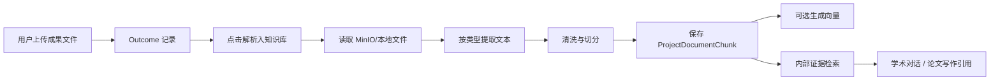

# 上传资料解析入知识库总纲

## 1. 需求理解

当前项目已经具备项目成果上传、下载、成果汇总、项目文献库、阅读笔记、证据检索和学术对话能力，但上传资料目前主要停留在“文件管理”。用户上传的 PDF、DOCX、TXT、MD 等资料没有被解析、切分、沉淀为项目知识库证据，因此后续学术对话、论文写作和材料生成无法稳定引用这些资料。

本方案目标是把“上传资料”升级为可检索、可追溯、可复用的项目内部知识来源。第一阶段不重做上传系统，不引入复杂全文批注，不做 OCR，只补齐最小闭环：用户上传资料后，可以触发解析入库；系统把文件内容切分为证据块；学术对话和写作检索可以召回这些证据块，并显示来源文件。

## 2. 范围确认

本轮按用户选择的 `B` 范围执行：

- 支持 TXT、MD、DOCX、PDF。
- DOCX 优先使用现有 `python-docx`。
- PDF 优先复用当前环境已有解析库；如果执行时确认没有可用库，再评估新增轻量依赖，例如 `pypdf` 或 `pdfplumber`。
- PDF 只支持文本型 PDF，不支持扫描件 OCR。
- 不新增复杂协作、批注、全文高亮、OCR 或全文检索引擎。

## 3. 关键假设

- 继续以 `Outcome` 作为资料上传入口，不新增独立上传页面。
- 文件原始内容仍由现有 `upload_service` 管理，知识库只保存解析后的文本块和元数据。
- 解析入库需要绑定项目和当前登录用户权限，不能跨项目读取资料。
- 知识库证据应能被当前 `evidence_retrieval_service` 统一召回。
- 如果 embedding 服务不可用，系统仍应保存文本块，并先用关键词检索兜底。
- 当前项目数据库偏 `create_all`/自动建表风格，迁移体系未完全规范；实施时优先跟随现有项目风格，不单独引入 Alembic 迁移体系。

## 4. 总体设计

新增“项目资料知识块”作为上传资料和 RAG 检索之间的中间层。用户上传成果后，成果列表中提供“解析入知识库”动作。后端读取已保存文件，按文件类型提取文本，清洗后切分为若干 chunk，保存为项目内部知识块。知识块记录来源成果、文件名、块序号、文本摘录、解析状态、解析错误和可选向量。

检索层扩展现有内部证据召回逻辑：除项目文献和阅读笔记外，再检索项目资料知识块。学术对话开启学术检索时，只要命中相关资料块，就把它作为“内部资料依据”放入上下文和前端依据来源中。

## 5. 分阶段实施

### 阶段 1：资料解析最小闭环

新增资料解析服务和知识块模型，支持 TXT、MD、DOCX、PDF 文本提取、清洗、切分和入库。先提供后端 API，可以对单个成果执行“解析入库”，并返回解析状态和 chunk 数。

### 阶段 2：内部证据检索接入

把项目资料知识块接入 `evidence_retrieval_service`，与项目文献、阅读笔记一起作为内部依据召回。先使用关键词评分，若向量服务可用再补充向量化写入和相似度检索。

### 阶段 3：前端入口与状态展示

在成果管理界面展示解析状态，提供“解析入知识库”“重新解析”入口。学术对话的依据来源中展示上传资料证据，包含来源文件、片段、命中原因和打开/下载入口。

### 阶段 4：稳定性与验证补强

补充后端单元测试、解析异常兜底、重复解析覆盖策略、文件类型提示和最小端到端烟测。此阶段只做稳定性，不扩展 OCR 或复杂知识库 UI。

## 6. 数据流

## 7. 建议新增或修改文件

- `backend/app/models/project_document_chunk.py`
- `backend/app/schemas/project_document.py`
- `backend/app/services/document_parse_service.py`
- `backend/app/services/project_knowledge_service.py`
- `backend/app/api/outcomes.py`
- `backend/app/services/evidence_retrieval_service.py`
- `backend/app/services/embedding_service.py`
- `backend/app/models/__init__.py` 或现有模型加载入口
- `backend/tests/test_project_document_parse_service.py`
- `backend/tests/test_outcome_knowledge_api.py`
- `frontend/src/lib/types.ts`
- `frontend/src/lib/api.ts`
- `frontend/src/components/OutcomeManager.tsx`
- `frontend/src/components/chat/ChatEvidenceRail.tsx`

## 8. 验收标准

- 上传 TXT、MD、DOCX、文本型 PDF 后，可以在成果列表触发“解析入知识库”。
- 解析成功后能看到状态为“已入库”，并显示 chunk 数。
- 解析失败时能看到明确失败原因，不影响原文件下载。
- 重复解析同一成果不会产生无限重复知识块，应先删除旧 chunk 或按版本覆盖。
- 学术对话中如果问题命中上传资料内容，依据来源能显示“内部资料”。
- 写作或对话生成内容不能把上传资料外的信息伪装成资料依据。
- 无 embedding 配置时，关键词检索仍能工作。
- 后端最小测试通过，前端构建通过。

## 9. 需要用户确认的事项

- 是否允许新增 `project_document_chunks` 数据表。
- PDF 解析如果当前环境没有可用库，是否允许新增一个轻量依赖；推荐优先 `pypdf`。
- 是否接受第一阶段不支持扫描件 OCR。
- 是否接受解析入口先放在项目详情页的成果管理区，而不是新增独立知识库页面。
