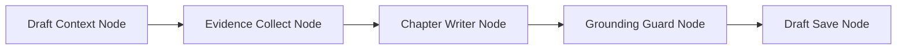

# 阶段 4：论文写作 Workflow 接入

## 1. 目标

把论文写作中的“证据收集 → 章节生成 → grounding 检查 → 保存草稿”整理成 workflow，降低生成内容无依据或凭空扩写的概率。

## 2. 优先接入章节生成

章节生成比大纲和摘要更容易出现幻觉，因此优先迁移：

## 3. 节点职责

- `DraftContextNode`：读取草稿、大纲、项目设计、已有章节。
- `EvidenceCollectNode`：读取项目文献、阅读笔记、上传资料 chunk、成果摘要。
- `ChapterWriterNode`：调用现有 `paper_writing_agent.generate_chapter`。
- `GroundingGuardNode`：调用现有 `validate_generated_chapter_grounding`。
- `DraftSaveNode`：保存章节、更新版本。

## 4. 验收标准

- 章节生成仍保持原 API。
- grounding 失败时能明确告诉用户缺少依据。
- workflow 记录里能看到章节使用了哪些证据类型。
- 不影响手动编辑保存。
